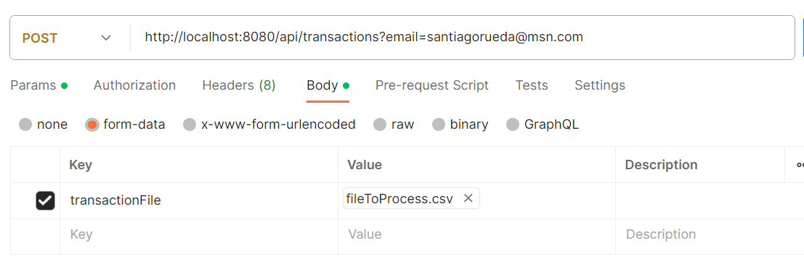

# Para correr el proyecto:

## Pasos para Ejecutar

0. Dentro del repositorio hay un archivo init.sql
   - Al correr el docker-compose up se levantara una instancia de postgres con la base de datos reada
   - En el archivo init.sql hay 2 tablas que deben estar creadas con el usuario insertado previo a ejecutar
   - En el csv que se envia esta el uid del usuario a insertar en las base de datos postgres
   - Al usar el servicio ya esta creaco el file csv a procesar en la request, se llama fileToProcess.csv

1. Clona este repositorio en tu máquina local:

```bash
git clone https://github.com/Santi1992/challenge.git
cd challenge
docker-compose up
```

2. Como usar el servicio. 

    - Se le debe hacer un post a http://localhost:8080/api/transactions?email=santiagorueda@msn.com  , como query param se le puede cambiar el email a donde quiere que lleguemos
    - como formdata se debe enviar en el file que esta en el proyecto con el nombre de transactionFile
    - Recorda revisar la casilla de spam.




3. La clave del postgres creado esta en el docker-compose.